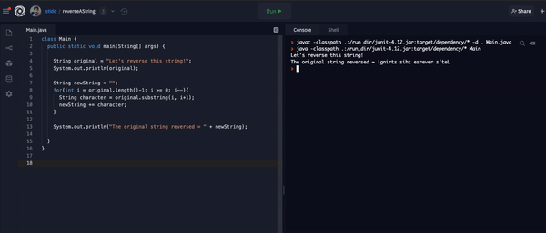

# Resources and Examples


Use these interactive slides to review the creation of algorithms and String methods




## Examples

Traversing a String in Java Video Tutorial



Reversing a String is a classic programming challenge. Here's an example!

